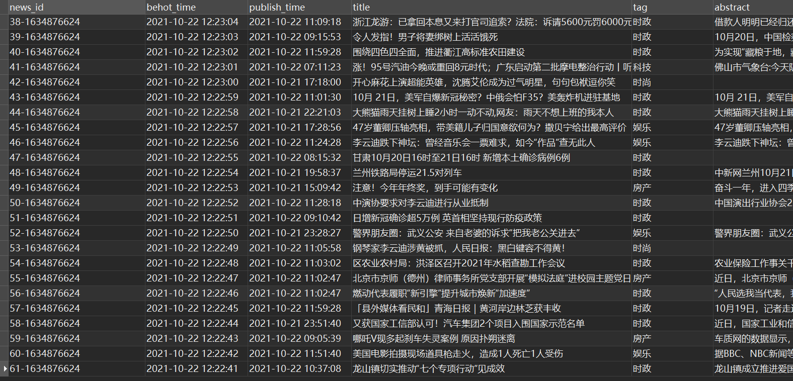
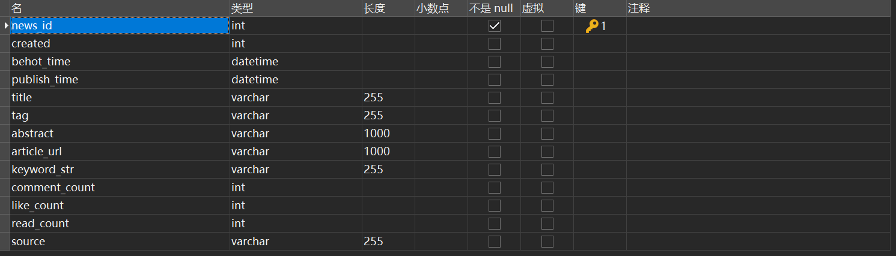
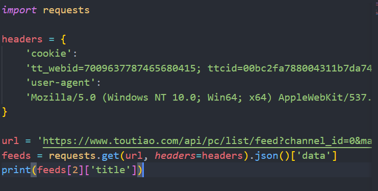
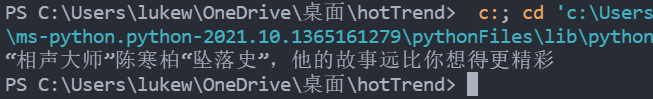
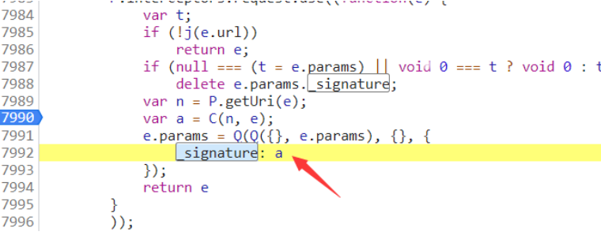
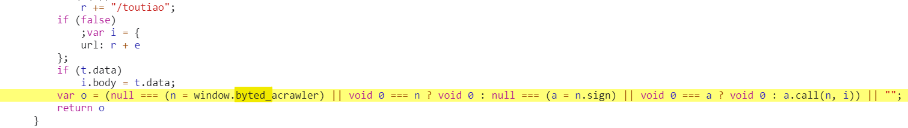
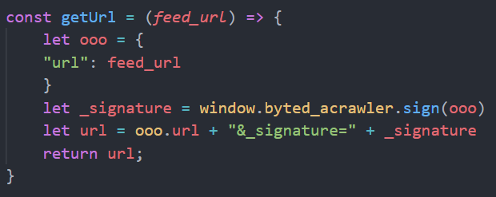
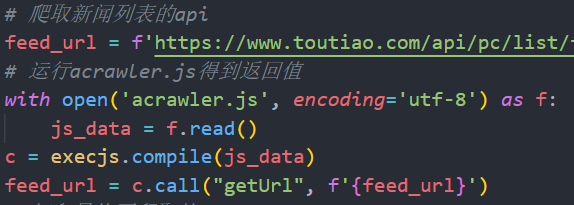

## 设计方案——数据爬取

#### 一、研究目标

 本次实验进行新闻热点趋势分析需要大量的原始数据，包括不同时段的新闻，及其热度度量标准的数据来源——评论阅读数，用户评论内容(用于)分析用户情感倾向，而本次数据来源主要为国内用户数量较多的新闻平台，包括网易新闻，今日头条等主流媒体

#### 二、研究内容
对得到的新闻进行清洗，然后进行新闻分类以及关键词提取，将提取的关键词作为主题，并且将用户的评论进行情感倾向分析，包括正向可能性以及可信度，同时通过一定的数学计算得到各主题的当前的热度值等量化标准

#### 三、方案设计

#### 1. 爬虫对象
 - 今日头条的九个主要板块
  
        热点, 财经, 科技, 娱乐, 体育, 时尚,科技, 游戏, 军事, 国际
 - 在代码中定义爬取对象：
    ```python
    # 需要爬取的评到及id
    array_channel_id = [
        '3189398996', '3189399007', '3189398999',  '3189398972', '3189398957',
        '3189398984', '3189398981', '3189398995', '3189398960', '3189398968'
    ]
    array_channel_name = [
        'hot', 'finance', 'tech', 'entertainment', 'sports', 'fashion',
        'digital', 'game', 'military', 'world'
    ]
    ```
#### 2. 编码工具及语言

 - python语言
 - 使用Pycharm或者Visual Studio Code

#### 3. 数据库设计
 - 新闻(News)表：`除了主键news_id其余皆可为空`
   | Name          | Type     | Length | Not Null | Key | Comment                    |
   | ------------- | -------- | ------ | -------- | --- | -------------------------- |
   | news_id       | varchar  | 255    | √        | √   | 新闻编号(爬取时间戳加序号) |
   | title         | varchar  | 255    | /        | /   | 新闻标题                   |
   | tag           | varchar  | 255    | /        | /   | 新闻分类                   |
   | abstract      | varchar  | 1000   | /        | /   | 新闻概要/新闻主体          |
   | article_url   | varchar  | 1000   | /        | /   | 新闻链接                   |
   | behot_time    | datetime | /      | /        | /   | 开始热门时间               |
   | publish_time  | datetime | /      | /        | /   | 发布时间                   |
   | keyword_str   | varchar  | 255    | /        | /   | 新闻关键词(5个)            |
   | comment_count | int      | /      | /        | /   | 评论数                     |
   | like_count    | int      | /      | /        | /   | 点赞数                     |
   | read_count    | int      | /      | /        | /   | 阅读数                     |
   | source        | varchar  | 255    | /        | /   | 来源/作者                  |
   | created       | datetime | /      | /        | /   | 爬取时间                   |
  - 
  
- 评论表(Comment)`将新闻表的news_id作为外键`
  | Name        | Type    | Length | Not Null | Key | Comment            |
  | ----------- | ------- | ------ | -------- | --- | ------------------ |
  | news_id     | varchar | 255    | √        | √   | 对应新闻编号       |
  | comment_str | varchar | 620    | /        | /   | 30条评论 tab键隔开 |
  | comment_url | varchar | 255    | /        | /   | 评论api            |
  | sentiment   | binary  | 1      | /        | /   | 评论平均情感倾向   |
  | positive    | binary  | 1      | /        | /   | 正向比例           |
  | confidence  | binary  | 1      | /        | /   | 自信度             |
- 
 

#### 4. 网站分析
- 今日头条网页信息并非静态数据，而是AJAX请求的

  AJAX请求是网站通过js脚本发起的请求连接，目的就是为了在不刷新网页的情况下就能实时的更新网页内容，从而在感觉上你是觉得他和网页源码拼接在一起。F12开发者模式从众多的链接中进行筛选，选择AJAX的类型——XHR，然后发现了动态更新的api，利用request包将其中的json数据进行分析，清洗得到需要的字段

  `以标题为例`带参请求api:
  
  
  得到标题：
  
- 请求参数分析

从上面图片来看，我们就能发现链接的参数和请求的headers的参数是有变化的。
变化参数的作用：
| 参数           | 作用                                                                                              | 加密 |
| -------------- | ------------------------------------------------------------------------------------------------- | ---- |
| max_behot_time | 连续获取用户的数据，用于赖加载上，第一次值默认为0，后续的值为上一次返回数据中的max_behot_time的值 | 否   |
| cookie         | 获得用户数据                                                                                      | 否   |
| channel_id     | 每个频道都有对应的channel_id                                                                      | 否   |
| _signature     | 用于反爬，通过链接以及用户cookie通过算法得出                                                      | 是   |

#### 四、系统实现
#### 1. 破解_signature
今日头条会通过用户的cookie以及请求api的链接本身得到一个参数，用于验证是否合理请求

首先全局搜索_signature,在某个js文件中找到

再追进I函数得到

关键在于window.byted_acrawler函数，此时再追踪跳进acrawler.js文件，将其下载到本地，然后采用nodejs本地运行，首先通过js逆向补充环境然后加上函数调用过后可以正常得到参数_signature

采用execjs包在使用python执行js代码，输入初始url，得到带上_signature参数的请用api

#### 2. 爬取新闻实体
每次爬取api会返回十个左右新闻，进行清洗后，将每个新闻封装为一个News对象，然后将带十个对象的列表传到数据库方法，存入数据库中
```python
# 封装每个新闻实体
class News:

    # 构造方法
    def __init__(self, news_id, title, tag, abstract, article_url, behot_time,
                 publish_time, comment_count, like_count, read_count, source,
                 keywordStr):
        self.news_id = news_id
        self.title = title
        self.tag = tag
        self.abstract = abstract
        self.article_url = article_url
        self.behot_time = behot_time
        self.publish_time = publish_time
        self.comment_count = comment_count
        self.like_count = like_count
        self.read_count = read_count
        self.source = source
        self.keywordStr = keywordStr
        self.keywordsToList()

    def keywordsToList(self):
        self.keywordList = self.keywordStr.split('  ')
```
调用的数据库插入方法
```python
# 插入新闻列表
def add_news(NewsList):
    try:
        # 插入sql语句
        sql = ("INSERT INTO news(news_id,behot_time,publish_time,title,"
               "tag,abstract,article_url,comment_count,"
               "like_count,read_count,source,keyword_str"
               ")"
               "VALUES(%s,%s,%s,%s,%s,%s,%s,%s,%s,%s,%s,%s)")
        for news in NewsList:
            cursor.execute(
                sql, (news.news_id, news.behot_time, news.publish_time,  news.title, news.tag, news.abstract,
                      news.article_url, news.comment_count, news.like_count, news.read_count,
                      news.source, news.keywordStr
                      ))
            db.commit()
            print(f'just added the news {news.news_id}')
    except Exception as e:
        print(e)
```
#### 3. 爬取评论实体
每次得到一个新闻对象，都判断其有无评论，若是有，则调用爬取评论方法，将新闻的id，评论数，新闻类型（文本或是视频），新闻的groupid传入爬取方法中
评论同样是采用动态调用api的方法，api包括以下参数

| 参数     | 作用                                   | 加密 |
| -------- | -------------------------------------- | ---- |
| group_id | 用于明确评论所在新闻类型，文本还是视频 | No   |
| item_id  | 新闻的编号                             | No   |
| offset   | 评论的起始位置                         | No   |
| count    | 需要返回的评论数，不够则返回最大数     | No   |

- 评论实体：
```python
class Comment:

    # 评论Comment的构造方法
    def __init__(self, news_id, comment_str, comment_url):
        self.news_id = news_id
        self.comment_str = comment_str
        self.comment_url = comment_url
        self.sentiment = None
        self.positive = None
        self.confidence = None
```
- 爬取方法如下：
```python
# 传入,news_id,news_url,boolean值（代表是不是视频）以及视频评论个数
def scrape_comment(news_id, url, is_video, commentCount):
    # 得到新闻id及评论个数
    if commentCount > 30:
        commentCount = 30
    group_id = url.split('/')[4]
    # 得到评论链接
    if(is_video):
        comment_url = f'https://www.ixigua.com/tlb/comment/article/v5/tab_comments/?tab_index=0&count={commentCount}&group_id={group_id}&item_id={group_id}&aid=1768'
    else:
        comment_url = f'https://www.toutiao.com/article/v2/tab_comments/?aid=24&app_name=toutiao_web&offset=0&count={commentCount}&group_id={group_id}&item_id={group_id}'
    # 爬取api
    data = requests.get(comment_url).json()['data']
    commentList = []
    comment_len = 0
    for item in data:
        text = item['comment']['text']
        comment_len += len(text)
        if comment_len < 600:
            commentList.append(text)
    # 返回
    comment = Comment(news_id, '    '.join(commentList), comment_url)
    return comment

```
- 之后将评论列表插入数据库
```python
# 插入评论的方法
def add_comments(commentList):
    try:
        # 插入列表sql语句
        sql = ("INSERT INTO comment(news_id,comment_str,comment_url,sentiment)"
               "VALUES(%s,%s,%s,%s)")
        for comment in commentList:
            cursor.execute(
                sql, (comment.news_id, comment.comment_str, comment.comment_url, comment.sentiment
                      ))
            db.commit()
            print(f'just added the comment {comment.news_id}')
    except Exception as e:
        print(e)

```
#### 五、总结

----

## 设计方案——新闻分类以及关键词提取
### 1. 概述
#### 1.1 案例背景
`新闻分类是文本分类中常见的应用场量。在传统分类模式下，往往是通过人工对新闻内容进行核对，从而将新闻划分到合适的类别中。这种方式会消耗大量的人力资源，并且效率不高。`
#### 1.2 任务和实现
`本项目新闻分类的任务在于，根据新闻文本中的内容，首先进行文件与处理，然后进行机器学习建模等操作，从而进一步将爬取到的新闻划分到最可能的分类中，节省人力资源，以下为具体实现的内容:`

* 能够对文本数据进行预处理。`文本清洗， 分词，去除停用词，文本向量化等操作。`
* 能够通过Python统计词频，生成词云图。`描述性统计分析`
* 能够通过方差分析，进行特征选择。 `验证性统计分析`
* 能够根据文本内容，对文本数据进行分类。`统计建模`

#### 1.3 任务扩展
新闻分裂是文本分类的常见场景，本案例的实现同样也可以应用到其他根据文本内容进行分类的场景，例如，垃圾邮件过滤，情感分析

#### 1.4 数据集描述
THUCNews是根据新浪新闻RSS订阅频道2005~2011年间的历史数据筛选过滤生成，包含74万篇新闻文档（2.19 GB），均为UTF-8纯文本格式。我们在原始新浪新闻分类体系的基础上，重新整合划分出14个候选分类类别：`财经、彩票、房产、股票、家居、教育、科技、社会、时尚、时政、体育、星座、游戏、娱乐`。
本次训练使用了其中的10个分类，每个分类6500条数据。
类别如下：

    体育, 财经, 房产, 家居, 教育, 科技, 时尚, 时政, 游戏, 娱乐

数据集划分如下：

* 训练集: 5000*10
* 验证集: 500*10
* 测试集: 1000*10
  
从原数据集生成子集的过程请参看helper下的两个脚本。其中，copy_data.sh用于从每个分类拷贝6500个文件，cnews_group.py用于将多个文件整合到一个文件中。执行该文件后，得到三个数据文件：

* cnews.train.txt: 训练集(50000条)
* cnews.val.txt: 验证集(5000条)
* cnews.test.txt: 测试集(10000条)

### 2. 加载数据

#### 2.1 准备工作
安装jieba，wordcloud库

#### 2.2 加载数据并预览
```python
import os

base_dir = 'data/cnews'
train_dir = os.path.join(base_dir, 'cnews.train.txt')
test_dir = os.path.join(base_dir, 'cnews.test.txt')
val_dir = os.path.join(base_dir, 'cnews.val.txt')

# 得到训练，测试，验证文本list
train_texts = open(train_dir, encoding='utf-8').read().split('\n')
test_texts = open(test_dir, encoding='utf-8').read().split('\n')
val_texts = open(val_dir, encoding='utf-8').read().split('\n')

# 得到对应的类别list
train_label = []
test_label = []
val_label = []

def getLabelList(newsList, labelList):
    for i in range(len(newsList)):
        labelList.append(newsList[i].split('\t')[0])
        newsList[i] = newsList[i].split('\t')[1]

getLabelList(train_texts, train_label)
getLabelList(test_texts, test_label)
getLabelList(val_texts, val_label)
```
### 3 数据预处理

#### 3.1 文本处理

#### 3.1.1 结构化数据与非结构化数据
结构化数据，是可以表示成多行多列的形式，并且，每行（ 列） 都有着具体的含义。非结构化数据，无法合理地表示为多行多列的形式，即使那样表示，每行（列）也没有具体的含义。
#### 3.1.2 文本数据预处理
文本数据，是一种非结构化数据，其预处理的步骤与方式也会与结构化数据有所差异。文本数据预处理主要包含：
* 缺失值处理
* 重复值处理
* 分词
* 停用词处理

#### 3.2 缺失值处理
当content字段（新闻内容）存在缺失值，根据实际情况选择用headline（标题）字段对应值填充并检查填充后结果。

#### 3.3 重复值处理
当新闻队列中有重复时，将其删除
```python
    news.drop_duplicates(inplace = True)
    print(news.duplicated().sum())
```
#### 3.4 分词（包括标点符号，特殊字符处理）
分词是将连续的文本，分割成语意合理的若干词汇序列，中文分词需要用jieba库中的方法实现分词功能:
```python
import jieba.posseg as pseg
s = '等到放晴的那天,《也许》我会比较好一点'
words = pseg.cut(s)
words_pure = []
for w in words:
    if w.flag != 'x':
        words_pure.append(w.word)
print(words_pure)
```


#### 3.6停用词处理
停用词，指的是在我们语句中大量出现，但却对语义分析没有帮助的词。对于这样的词汇，我们通常可以将其删除，这样的好处在于：可以降低存储空间消耗、可以减少计算时间消耗。 对于哪些词属于停用词，已经有统计好的停用词列表，我们直接使用就好。

```python
stopwords = set()

with open('D:/Coding/news-classfication/data/cnews/cn_stopwords.txt', 'r', encoding='utf-8') as f:
    for line in f:
        stopwords.add(line.strip())

def remove_stopword(words):
    return [word for word in words if word not in stopwords]

s = ['等到', '放晴', '的', '那天', '也许', '我会', '比较', '好', '一点']

print(remove_stopword(s))
```


### 4 文本向量化
对文本数据进行建模，需要解决以下两个问题：

* 模型进行的是数学运算， 因此需要数值类型的数据， 而文本不是数值类型数据。
* 模型需要结构化数据， 而文本是非结构化数据。

将文本转换为数值特征向量的过程，称为文本向量化。文本向量化分为以下两步：

* 对文本分词， 拆分成更容处理的单词。
* 将单词转换为数值类型， 即使用合适的数值来表示每个单词。

#### 5.1 词袋模型
词袋模型，直观上理解，就是一个装满单词的袋子。实际上，词袋模型是一种能够将文本向量化的方式。在词袋模型中，每个文档为一个样本，每个不重复的单词为一个特征，单词在文档中出现的次数作为特征值。例如，给定如下的文档集：
    
    Where there is a will, there is a way
    There is no royal road to learning

如果转换为词袋模型， 则结果为：


```python
from sklearn.feature_extraction.text import CountVectorizer

count = CountVectorizer()

docs = [
    'Where there is a will, there is a way',
    'There is no royal road to learning'
]

# 以下相当于两步，先fit(训练)，再transform(转化)
bag = count.fit_transform(docs)

print(bag)
# 输出稀疏矩阵（0的不显示）
# 系数举证香蕉稠密矩阵效果更好，占用内存少

print(bag.toarray())
# 转化为稠密矩阵，均显示

print(count.get_feature_names_out())
# 获取特征单词

print(count.vocabulary_)
# 输出特征单词与编号的映射关系
```

这里需要留意的是，默认情况下，CountVectorizer 只会对字符长度不小于2 的单词进行处理，如果单词长度小于2 （ 单词仅有一个字符） ，则会忽略该单词，例如，上例中的单词“ a ” ，并没有作为特征进行向量化。经过训练后，countvectorizer 就可以对未知文档（ 训练集外的文档） 进行向量化。当然，`向量化的特征仅为训练集中出现的单词特征，如果未知文档中的单词不在训练集中，则在词袋模型中无法体现。`

#### 5.2 TF-IDF
通过CountVectorizer 类，我们能够将文档向量化处理。在向量化过程中，我们使每个文档中单词的频数作为对应待征的取值。这是合理的，因为，单词出现的次数越多，我们就认为该单词理应比出现次数少的单词更加重要。然而，这是相对的，有些单词，我们不能仅以当前文档中的频数来进行衡量，还要考虑其在语料库中，在其他文档中出现的次数。因为有些单词，确实是非常常见的，其在语料库所有的文档中，可能都会频繁出现，对于这样的单词，我们就应该降低其重要性。例如，在新闻联播中，”中国“、”发展“等单词，在语料库中出现的频率非常高，即使这些词在某篇文档中频繁出现，也不能说明这些词对当前文档是非常重要的，因为这些词并不含有特别有意义的信息。 `TF-IDF `可以用来调整单词在文档中的权重，其由两部分组成：

* TF (Term-Frequency) 词频， 指一个单词在文档中出现的次数。
* IDF (lnverse Document-Frequency)逆文档频率。

其计算方式如下：

使用TfidfTransformer进行TF-IDF转化，此外，scikit-learn 同时提供了一个类TfidfVectorizer, 其可以直接将文档转换为TF-IDF值，也就是说，该类相当于集成了CountVectorizer 与TfidfTransformer两个类的功能，十分便利。
```python
from sklearn.feature_extraction.text import CountVectorizer
from sklearn.feature_extraction.text import TfidfTransformer

count = CountVectorizer()
docs = [
    'Where there is a will, there is a way',
    'There is no royal road to learning'
]
# 以下相当于两步，先fit(训练)，再transform(转化)
bag = count.fit_transform(docs)

# 进行TF-IDF转换
tfdif = TfidfTransformer()
t = tfdif.fit_transform(bag)
print(t.toarray())
```

```
以上方法为使用词袋模型向量化（CountVectorizer()）
和TF-IDF(TfidfTransformer())共同调整单词在文档中的权重
TfidfVectorizer()类集成了上述两个类的功能，可直接使用
```
```python
from sklearn.feature_extraction.text import TfidfVectorizer

docs = [
    'Where there is a will, there is a way',
    'There is no royal road to learning'
]

tfdif = TfidfVectorizer()
# 直接使用该类，更加便利
t = tfdif.fit_transform(docs)
print(t.toarray())
```
.png)

### 6 建立模型
6.1 训练集与测试集最终成型

    我们需要将每条新闻的词汇进行整理。目前，我们文本内容已经完成了
    分词处理，但词汇是以列表类型呈现的，为了方便后续的向量化操作（ 
    文本向量化需要传递空格分开的字符串数组类型） ，我们将每条新闻的
    词汇组合在一起，成为字符串类型，使用空格分隔。

```python
# 3.将每条新闻的分词后数组转化为空格分隔的字符串
def join(text_list):
    return " ".join(text_list)


# 4.对应的分词方法（去除每个flag为x,即标点符号）
def cut2words(newsList):
    for i in range(len(newsList)):
        words = pseg.cut(newsList[i])
        newsList[i] = []
        for w in words:
            if w.flag != 'x':
                newsList[i].append(w.word)
        # 调用去除停用词方法
        newsList[i] = remove_stopword(newsList[i])
        # 调用转为字符串方法
        newsList[i] = join(newsList[i])
        print(i)
```


然后从写入的文件中读出所需要的所有数据集
```python
from sklearn.feature_selection import SelectKBest
import os
import numpy as np
from sklearn.feature_extraction.text import TfidfVectorizer
from sklearn.feature_selection import f_classif

# 一、读取得到训练集，测试集，验证机文本，并得到其分类标签列表


# 1.进行文件读取
base_dir = 'dataset'
X_train_dir = os.path.join(base_dir, 'train_contents.txt')
X_test_dir = os.path.join(base_dir, 'test_contents.txt')
X_val_dir = os.path.join(base_dir, 'val_contents.txt')
y_train_dir = os.path.join(base_dir, 'train_label.txt')
y_test_dir = os.path.join(base_dir, 'test_label.txt')
y_val_dir = os.path.join(base_dir, 'val_label.txt')

X_train = open(X_train_dir, encoding='utf-8').read().split('\n')
X_test = open(X_test_dir, encoding='utf-8').read().split('\n')
X_val = open(X_val_dir, encoding='utf-8').read().split('\n')
y_train = open(y_train_dir, encoding='utf-8').read().split('\n')
y_test = open(y_test_dir, encoding='utf-8').read().split('\n')
y_val = open(y_val_dir, encoding='utf-8').read().split('\n')


# 2.将类别标签离散化
def map2digits(x):
    if x == '体育':
        return 0
    elif x == '财经':
        return 1
    elif x == '房产':
        return 2
    elif x == '家居':
        return 3
    elif x == '教育':
        return 4
    elif x == '科技':
        return 5
    elif x == '时尚':
        return 6
    elif x == '时政':
        return 7
    elif x == '游戏':
        return 8
    else:
        return 9


y_train = list(map(map2digits, y_train))
y_test = list(map(map2digits, y_test))
y_val = list(map(map2digits, y_val))


print('训练集样本数：', len(X_train), '测试机样本数：', len(X_test),'验证集样本数：', len(X_val))
```


#### 6.2 特征选择
#### 6.2.1 特征维度-方差分析
    到目前为止，数据集X还是文本类型，我们需要对其
    进行向量化操作。这里，我们使TfidfVectorizer
    类，在训练集上进行训练，然后分别对训练集与测试
    集实施转换。 使用词袋模型向量化后，会产生过多
    的特征，这些特征会对存储与计算造成巨大的压力，
    同时，并非所有的特征都对建模有帮助，基于以上原
    因，我们在将数据送入模型之前，先进行特征选择。
    这里，我们使用方差分析(ANOVA) 来进行特征选
    择，选择与目标分类变量最相关的20000 个特征。
    方差分析用来分析两个或多个样本（ 来自不同总
    体） 的均值是否相等，进而可以用来检验分类变量
    与连续变量之间是否相关。

```python
# 二、使用TfidVectorizer()进行向量化

# ngram_range=(1,2)先将新闻切分为一维/二维元组再进行向量化
# 减少语句本来不同但切分出的单词相同带来的误差
vec = TfidfVectorizer(ngram_range=(1, 2))

X_train_tran = vec.fit_transform(X_train)
print('X_train vecterized')
X_test_tran = vec.transform(X_test)
print('X_test vectorized')
X_val_tran = vec.transform(X_val)
print('X_val vecterized')
print(X_train_tran.shape, X_test_tran.shape, X_val_tran.shape)
```

```python
from sklearn.feature_extraction.text import TfidfVectorizer
from sklearn.feature_selection import f_classif

# 词袋模型向量化后会产生过多特征，用方差分析进行特征选择
# 选择出与目标相对变量最相关的20000个特征
print(f_classif(X_train_tran, y_train))


# 将数组转化为float32的numpy数组
X_train_tran = X_train_tran.astype(np.float32)
X_test_tran = X_test_tran.astype(np.float32)
X_val_tran = X_val_tran.astype(np.float32)

selector = SelectKBest(f_classif, k=min(20000, X_train_tran.shape[1]))
selector.fit(X_train_tran, y_train)
X_train_tran = selector.transform(X_train_tran)
X_test_tran = selector.transform(X_test_tran)
X_val_tran = selector.transform(X_val_tran)
print(X_train_tran.shape, X_test_tran.shape, X_val_tran.shape)
```


#### 6.3 分类模型评估标准
混淆矩阵：可以来评估模型分类的正确性。该矩阵是一个方阵， 矩阵的数值来表示分类器预测的结果， 包括真正例(True Positive ） 假正例(FaIsePositive) 真负例(True Negative ）假负例(False Negative)

> |      | 负例         | 正例         |
> | ---- | ------------ | ------------ |
> | 负例 | 真负例（TN） | 假正例（FP） |
> | 正例 | 假负例（FN） | 真正例（TP） |
分类模型的评估标准一般最常见使用的是准确率，即预测结果正确的百分比。准确率是相对所有分类结果；精确率、召回率、F1-score是相对于某一个分类的预测评估标准。 
* 准确率（Accuracy）:预测结果正确的百分比 —— (TP+TN)/(TP+TN+FP+FN) 
* 精确率(Precision)：预测结果为正例样本中真实为正例的比例（查的准）—— TP/(TP+FP)
*  召回率(Recall)：真实为正例的样本中预测结果为正例的比例（查的全）—— TP/(TP+FN) 
*  综合指标(F1-score)：综合评估准确率与召回率，反映了模型的稳健型 —— 2PrecisionRecall/(Precision+Recall) 可调用如下方法做出评估：

    >  * sklearn.metrics.classification_report(y_true, y_pred, target_names=None)
    >  * `y-true` ： 真实目标值
    >  * `y-pred` ： 估计器预测的目标值
    >  * `target-names` ： 目标类别名称
    >  * `return`: 每个类别预测的精确率、召回率、F1-score

#### 6.4 朴素贝叶斯

```python
# 朴素贝叶斯
from sklearn.metrics import classification_report
from sklearn.model_selection import GridSearchCV
from sklearn.preprocessing import FunctionTransformer
from sklearn.naive_bayes import GaussianNB, BernoulliNB, MultinomialNB, ComplementNB
from sklearn.pipeline import Pipeline

steps = [('dense', FunctionTransformer(
    func=lambda X: X.toarray(), accept_sparse=True)),
    ('model', None)
]
pipe = Pipeline(steps=steps)
param = {
    'model': [GaussianNB(), BernoulliNB(), MultinomialNB(), ComplementNB()]
}
gs = GridSearchCV(estimator=pipe, param_grid=param, cv=2,
                  scoring='f1', n_jobs=1, verbose=10)
gs.fit(X_train_tran, y_train)
print(gs.best_params_)
y_hat = gs.best_estimator_.predict(X_test_tran)
print(classification_report(y_test, y_hat))
```

> * 准确率（Accuracy）: 0.91
> * 精确率(Precision)：0.92
> * 召回率(Recall)：0.91
> * 综合指标(F1-score)：0.91
> * 各项指标来看，在本次案例中，朴素贝叶斯拟合效果较好。

