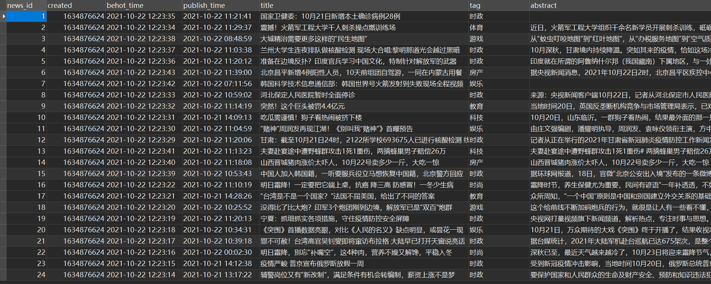

### 								设计方案——数据爬取

#### 一、研究目标

 本次实验进行新闻热点趋势分析需要大量的原始数据，包括不同时段的新闻，及其热度度量标准的数据来源——评论阅读数，用户评论内容(用于)分析用户情感倾向，而本次数据来源主要为国内用户数量较多的新闻平台，包括网易新闻，今日头条等主流媒体

#### 二、研究内容
对得到的新闻进行清洗，然后进行新闻分类以及关键词提取，将提取的关键词作为主题，并且将用户的评论进行情感倾向分析，包括正向可能性以及可信度，同时通过一定的数学计算得到各主题的当前的热度值

#### 三、方案设计

#### 1. 爬虫对象
 - 今日头条的九个主要板块
  
        热点, 财经, 科技, 娱乐, 体育, 时尚,科技, 游戏, 军事, 国际
 - 在代码中定义爬取对象：
    ```python
    # 需要爬取的评到及id
    array_channel_id = [
        '3189398996', '3189399007', '3189398999',  '3189398972', '3189398957',
        '3189398984', '3189398981', '3189398995', '3189398960', '3189398968'
    ]
    array_channel_name = [
        'hot', 'finance', 'tech', 'entertainment', 'sports', 'fashion',
        'digital', 'game', 'military', 'world'
    ]
    ```
#### 2. 编码工具及语言

 - python语言
 - 使用Pycharm或者Visual Studio Code

#### 3. 数据库设计
 - 新闻(News)表：`除了主键news_id其余皆可为空`
   | Name          | Type     | Length | Not Null | Key | Comment                    |
   | ------------- | -------- | ------ | -------- | --- | -------------------------- |
   | news_id       | varchar  | 255    | √        | √   | 新闻编号(爬取时间戳加序号) |
   | title         | varchar  | 255    | /        | /   | 新闻标题                   |
   | tag           | varchar  | 255    | /        | /   | 新闻分类                   |
   | abstract      | varchar  | 1000   | /        | /   | 新闻概要/新闻主体          |
   | article_url   | varchar  | 1000   | /        | /   | 新闻链接                   |
   | behot_time    | datetime | /      | /        | /   | 开始热门时间               |
   | publish_time  | datetime | /      | /        | /   | 发布时间                   |
   | keyword_str   | varchar  | 255    | /        | /   | 新闻关键词(5个)            |
   | comment_count | int      | /      | /        | /   | 评论数                     |
   | like_count    | int      | /      | /        | /   | 点赞数                     |
   | read_count    | int      | /      | /        | /   | 阅读数                     |
   | source        | varchar  | 255    | /        | /   | 来源/作者                  |
   | created       | datetime | /      | /        | /   | 爬取时间                   |
  - 
  
- 评论表(Comment)`将新闻表的news_id作为外键`
  | Name        | Type    | Length | Not Null | Key | Comment            |
  | ----------- | ------- | ------ | -------- | --- | ------------------ |
  | news_id     | varchar | 255    | √        | √   | 对应新闻编号       |
  | comment_str | varchar | 620    | /        | /   | 30条评论 tab键隔开 |
  | comment_url | varchar | 255    | /        | /   | 评论api            |
  | sentiment   | binary  | 1      | /        | /   | 评论平均情感倾向   |
  | positive    | binary  | 1      | /        | /   | 正向比例           |
  | confidence  | binary  | 1      | /        | /   | 自信度             |
- 
 

#### 4. 网站分析
- 今日头条网页信息并非静态数据，而是AJAX请求的

  AJAX请求是网站通过js脚本发起的请求连接，目的就是为了在不刷新网页的情况下就能实时的更新网页内容，从而在感觉上你是觉得他和网页源码拼接在一起。F12开发者模式从众多的链接中进行筛选，选择AJAX的类型——XHR，然后发现了动态更新的api，利用request包将其中的json数据进行分析，清洗得到需要的字段

  `以标题为例`带参请求api:
  
  
  得到标题：
  
- 请求参数分析

从上面图片来看，我们就能发现链接的参数和请求的headers的参数是有变化的。
变化参数的作用：
| 参数           | 作用                                                                                              | 加密 |
| -------------- | ------------------------------------------------------------------------------------------------- | ---- |
| max_behot_time | 连续获取用户的数据，用于赖加载上，第一次值默认为0，后续的值为上一次返回数据中的max_behot_time的值 | 否   |
| cookie         | 获得用户数据                                                                                      | 否   |
| channel_id     | 每个频道都有对应的channel_id                                                                      | 否   |
| _signature     | 用于反爬，通过链接以及用户cookie通过算法得出                                                      | 是   |

#### 四、系统实现
#### 1. 破解_signature
今日头条会通过用户的cookie以及请求api的链接本身得到一个参数，用于验证是否合理请求

首先全局搜索_signature,在某个js文件中找到

再追进I函数得到

关键在于window.byted_acrawler函数，此时再追踪跳进acrawler.js文件，将其下载到本地，然后采用nodejs本地运行，首先通过js逆向补充环境然后加上函数调用过后可以正常得到参数_signature

采用execjs包在使用python执行js代码，输入初始url，得到带上_signature参数的请用api

#### 2. 爬取新闻实体
每次爬取api会返回十个左右新闻，进行清洗后，将每个新闻封装为一个News对象，然后将带十个对象的列表传到数据库方法，存入数据库中
```python
# 封装每个新闻实体
class News:

    # 构造方法
    def __init__(self, news_id, title, tag, abstract, article_url, behot_time,
                 publish_time, comment_count, like_count, read_count, source,
                 keywordStr):
        self.news_id = news_id
        self.title = title
        self.tag = tag
        self.abstract = abstract
        self.article_url = article_url
        self.behot_time = behot_time
        self.publish_time = publish_time
        self.comment_count = comment_count
        self.like_count = like_count
        self.read_count = read_count
        self.source = source
        self.keywordStr = keywordStr
        self.keywordsToList()

    def keywordsToList(self):
        self.keywordList = self.keywordStr.split('  ')
```
调用的数据库插入方法
```python
# 插入新闻列表
def add_news(NewsList):
    try:
        # 插入sql语句
        sql = ("INSERT INTO news(news_id,behot_time,publish_time,title,"
               "tag,abstract,article_url,comment_count,"
               "like_count,read_count,source,keyword_str"
               ")"
               "VALUES(%s,%s,%s,%s,%s,%s,%s,%s,%s,%s,%s,%s)")
        for news in NewsList:
            cursor.execute(
                sql, (news.news_id, news.behot_time, news.publish_time,  news.title, news.tag, news.abstract,
                      news.article_url, news.comment_count, news.like_count, news.read_count,
                      news.source, news.keywordStr
                      ))
            db.commit()
            print(f'just added the news {news.news_id}')
    except Exception as e:
        print(e)
```
#### 3. 爬取评论实体
每次得到一个新闻对象，都判断其有无评论，若是有，则调用爬取评论方法，将新闻的id，评论数，新闻类型（文本或是视频），新闻的groupid传入爬取方法中
评论同样是采用动态调用api的方法，api包括以下参数

| 参数     | 作用                                   | 加密 |
| -------- | -------------------------------------- | ---- |
| group_id | 用于明确评论所在新闻类型，文本还是视频 | No   |
| item_id  | 新闻的编号                             | No   |
| offset   | 评论的起始位置                         | No   |
| count    | 需要返回的评论数，不够则返回最大数     | No   |

- 评论实体：
```python
class Comment:

    # 评论Comment的构造方法
    def __init__(self, news_id, comment_str, comment_url):
        self.news_id = news_id
        self.comment_str = comment_str
        self.comment_url = comment_url
        self.sentiment = None
        self.positive = None
        self.confidence = None
```
- 爬取方法如下：
```python
# 传入,news_id,news_url,boolean值（代表是不是视频）以及视频评论个数
def scrape_comment(news_id, url, is_video, commentCount):
    # 得到新闻id及评论个数
    if commentCount > 30:
        commentCount = 30
    group_id = url.split('/')[4]
    # 得到评论链接
    if(is_video):
        comment_url = f'https://www.ixigua.com/tlb/comment/article/v5/tab_comments/?tab_index=0&count={commentCount}&group_id={group_id}&item_id={group_id}&aid=1768'
    else:
        comment_url = f'https://www.toutiao.com/article/v2/tab_comments/?aid=24&app_name=toutiao_web&offset=0&count={commentCount}&group_id={group_id}&item_id={group_id}'
    # 爬取api
    data = requests.get(comment_url).json()['data']
    commentList = []
    comment_len = 0
    for item in data:
        text = item['comment']['text']
        comment_len += len(text)
        if comment_len < 600:
            commentList.append(text)
    # 返回
    comment = Comment(news_id, '    '.join(commentList), comment_url)
    return comment

```
- 之后将评论列表插入数据库
```python
# 插入评论的方法
def add_comments(commentList):
    try:
        # 插入列表sql语句
        sql = ("INSERT INTO comment(news_id,comment_str,comment_url,sentiment)"
               "VALUES(%s,%s,%s,%s)")
        for comment in commentList:
            cursor.execute(
                sql, (comment.news_id, comment.comment_str, comment.comment_url, comment.sentiment
                      ))
            db.commit()
            print(f'just added the comment {comment.news_id}')
    except Exception as e:
        print(e)

```
#### 五、总结

----

### 						设计方案——新闻分类以及关键词提取

三、方案设计

 1. 新闻分类
    - 
 2. URL管理

